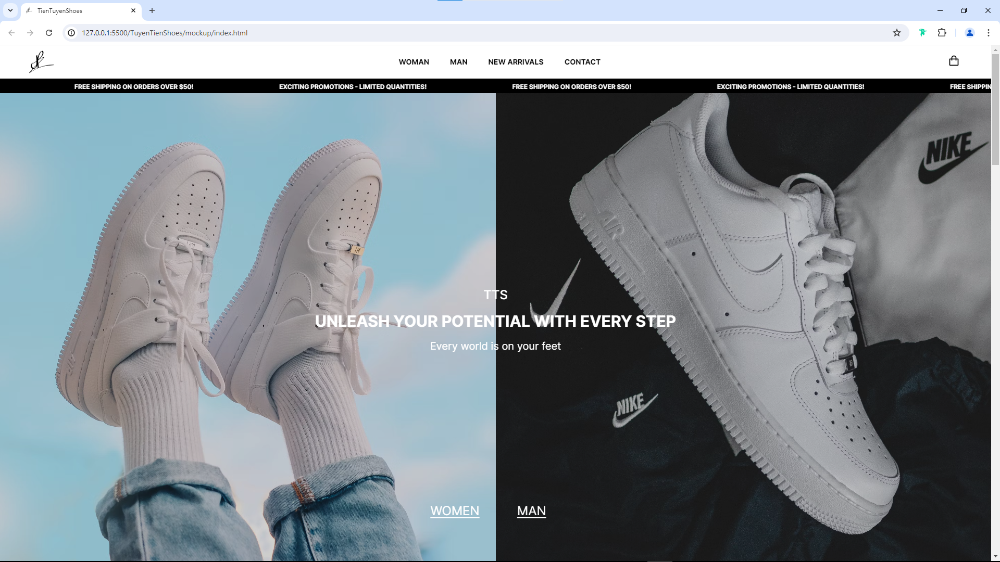

# Shoes Website TuyenTien

# Overview
Our Nike shoe sales project offers authentic products like Air Max, Air Jordan, and Flyknit. We not only sell shoes but also build a community for sports enthusiasts, helping customers share experiences and stay updated on new trends. With excellent customer service, we ensure a great shopping experience.

# Technologies
This project is built with robust and modern technologies to ensure high performance and scalability:
- EJS templates for rendering HTML pages.
- Prisma ORM for database access.
- MySQL database.
- Environment variables using dotenv.
- Tailwind CSS for styling.
- ESLint and Prettier for code linting and formatting.
- Nodemon for auto-reloading the server during development.
- Winston for logging.
- Express-validator for request validation.
- Helmet for securing the app by setting various HTTP headers.
- Compression for compressing the response data.
- Morgan for logging HTTP requests.
- Vite for building the frontend assets. Support - HMR (Hot Module Replacement) in development mode.
- Build the frontend assets with npm run build.

# Our production
https://sungoat1001.github.io/TuyenTienShoes/

# Contributors

- Le Pham Ngoc Tien - 22090007
- Huynh Anh Tien - 22090016
- Nguyen The Tuyen - 22090003

# Table of content

1. [wireframe](./wireframe/README.md)
2. [planning](./planning/README.md)
3. [mockup](./mockup/)
4. [screenshot](./screenshot/)
5. [database](./database/)

## Video demo
