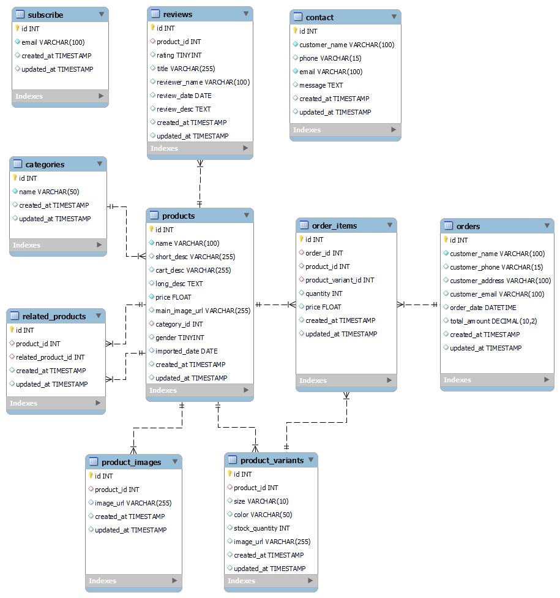

# Database Schema Documentation

This document provides a detailed description of the database schema for the project. The schema consists of the following tables: `subscribe`, `reviews`, `contact`, `categories`, `products`, `related_products`, `order_items`, `orders`, `product_images`, and `product_variants`.

## Overview

The database schema is designed to manage a product catalog and related customer interactions. The key components of the schema include:

## Tables and Their Descriptions

### 1. `subscribe`

**Description**: This table stores information about subscribers.

**Columns**:
- `id`: The unique identifier for each subscription entry.
- `email`: The email address of the subscriber.
- `created_at`: The timestamp when the subscription was created.
- `updated_at`: The timestamp when the subscription was last updated.

### 2. `reviews`

**Description**: This table stores reviews given by customers for products.

**Columns**:
- `id`: The unique identifier for each review.
- `product_id`: The identifier of the product being reviewed.
- `rating`: The rating given by the customer (1-5).
- `title`: The title of the review.
- `reviewer_name`: The name of the reviewer.
- `review_date`: The date when the review was written.
- `review_desc`: The detailed description of the review.
- `created_at`: The timestamp when the review was created.
- `updated_at`: The timestamp when the review was last updated.

**Relationships**:
- `product_id` references `products.id`: Each review is associated with a specific product.

### 3. `contact`

**Description**: This table stores contact messages from customers.

**Columns**:
- `id`: The unique identifier for each contact message.
- `customer_name`: The name of the customer.
- `phone`: The phone number of the customer.
- `email`: The email address of the customer.
- `message`: The message sent by the customer.
- `created_at`: The timestamp when the message was created.
- `updated_at`: The timestamp when the message was last updated.

### 4. `categories`

**Description**: This table stores information about product categories.

**Columns**:
- `id`: The unique identifier for each category.
- `name`: The name of the category.
- `created_at`: The timestamp when the category was created.
- `updated_at`: The timestamp when the category was last updated.

### 5. `products`

**Description**: This table stores information about products.

**Columns**:
- `id`: The unique identifier for each product.
- `name`: The name of the product.
- `short_desc`: A short description of the product.
- `cart_desc`: A description of the product for the cart.
- `long_desc`: A detailed description of the product.
- `price`: The price of the product.
- `main_image_url`: The URL of the main image of the product.
- `category_id`: The identifier of the category to which the product belongs.
- `gender`: The gender category for the product (if applicable).
- `imported_date`: The date when the product was imported.
- `created_at`: The timestamp when the product was created.
- `updated_at`: The timestamp when the product was last updated.

**Relationships**:
- `category_id` references `categories.id`: Each product belongs to one category, but a category can have multiple products.

### 6. `related_products`

**Description**: This table stores information about related products.

**Columns**:
- `id`: The unique identifier for each related product entry.
- `product_id`: The identifier of the product.
- `related_product_id`: The identifier of the related product.
- `created_at`: The timestamp when the related product entry was created.
- `updated_at`: The timestamp when the related product entry was last updated.

**Relationships**:
- `product_id` references `products.id`: Each entry associates a product with another related product.
- `related_product_id` references `products.id`: Each entry associates a product with another related product.

### 7. `order_items`

**Description**: This table stores information about items in an order.

**Columns**:
- `id`: The unique identifier for each order item.
- `order_id`: The identifier of the order.
- `product_id`: The identifier of the product.
- `product_variant_id`: The identifier of the product variant.
- `quantity`: The quantity of the product ordered.
- `price`: The price of the product.
- `created_at`: The timestamp when the order item was created.
- `updated_at`: The timestamp when the order item was last updated.

**Relationships**:
- `order_id` references `orders.id`: Each order item is part of an order.
- `product_id` references `products.id`: Each order item references a specific product.
- `product_variant_id` references `product_variants.id`: Each order item references a specific product variant.

### 8. `orders`

**Description**: This table stores information about orders placed by customers.

**Columns**:
- `id`: The unique identifier for each order.
- `customer_name`: The name of the customer.
- `customer_phone`: The phone number of the customer.
- `customer_address`: The address of the customer.
- `customer_email`: The email address of the customer.
- `order_date`: The date and time when the order was placed.
- `total_amount`: The total amount of the order.
- `created_at`: The timestamp when the order was created.
- `updated_at`: The timestamp when the order was last updated.

### 9. `product_images`

**Description**: This table stores images related to products.

**Columns**:
- `id`: The unique identifier for each product image.
- `product_id`: The identifier of the product.
- `image_url`: The URL of the image.
- `created_at`: The timestamp when the product image was created.
- `updated_at`: The timestamp when the product image was last updated.

**Relationships**:
- `product_id` references `products.id`: Each image is associated with a specific product.

### 10. `product_variants`

**Description**: This table stores information about different variants of products.

**Columns**:
- `id`: The unique identifier for each product variant.
- `product_id`: The identifier of the product.
- `size`: The size of the product variant.
- `color`: The color of the product variant.
- `stock_quantity`: The stock quantity of the product variant.
- `image_url`: The URL of the image of the product variant.
- `created_at`: The timestamp when the product variant was created.
- `updated_at`: The timestamp when the product variant was last updated.

**Relationships**:
- `product_id` references `products.id`: Each variant is associated with a specific product.
